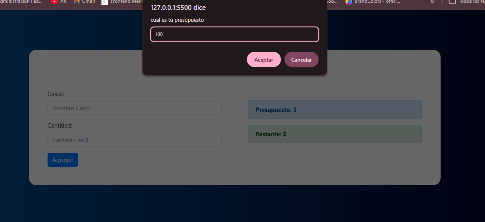
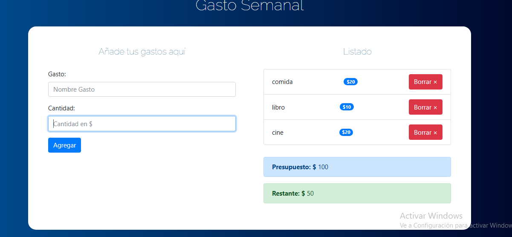
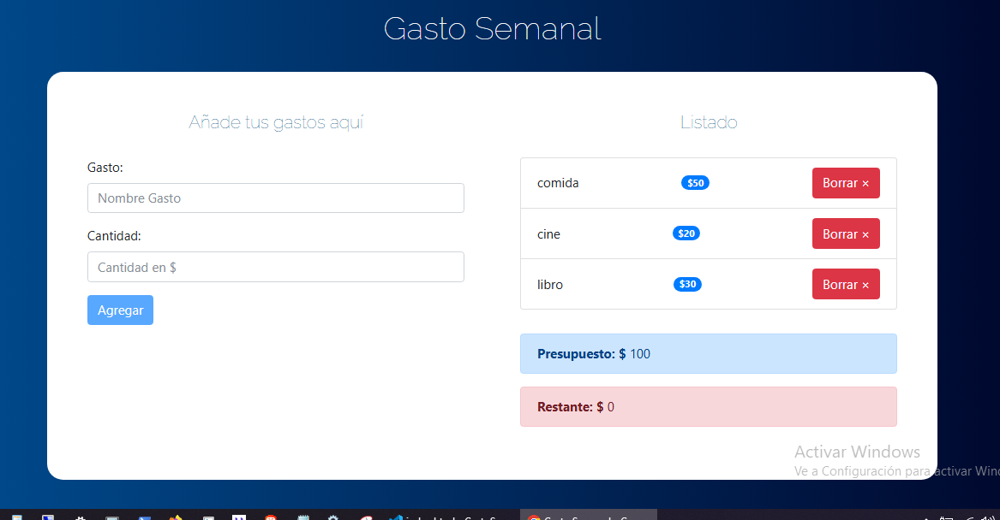
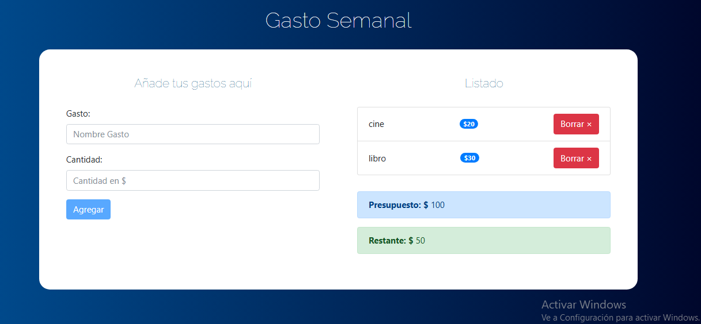

# Gasto Semanal

Una aplicación web ligera para gestionar el presupuesto semanal y controlar los gastos diarios. Ideal para usuarios que quieren visualizar su presupuesto, añadir nuevos gastos y llevar un control claro del saldo restante.

---

## Demo en vivo

- Visualiza el proyecto localmente abriendo `index.html` en tu navegador.
- Si lo subes a GitHub, puedes habilitar GitHub Pages en la rama principal para tener un demo en vivo automático.

---

## Capturas de pantalla

---

## Funcionalidades

- Solicita el presupuesto inicial al cargar la aplicación.
- Permite añadir gastos con nombre y cantidad.
- Muestra un listado dinámico de los gastos agregados.
- Calcula y muestra el presupuesto total y el restante.
- Cambia el color del estado del presupuesto según el porcentaje restante.
- Permite eliminar gastos uno a uno.
- Valida entradas y muestra alertas de error o éxito.

---

## Tecnologías usadas

- HTML5
- CSS3
- Bootstrap 4
- JavaScript vanilla

---

## Estructura del proyecto

- `index.html` - Página principal de la aplicación.
- `css/bootstrap.min.css` - Estilos de Bootstrap.
- `css/custom.css` - Estilos personalizados.
- `js/app.js` - Lógica de gestión de presupuesto y gastos.
- `img/` - Capturas de pantalla del proyecto.

---

## Cómo usar

1. Abre `index.html` en tu navegador.
2. Ingresa tu presupuesto inicial cuando se te solicite.
3. Añade gastos con su nombre y cantidad.
4. Observa el presupuesto restante y gestiona tus gastos.
5. Elimina gastos si es necesario.

---

## Autor

**Javier**

- Proyecto creado como una herramienta sencilla para controlar el gasto semanal.
- Listo para subir a GitHub y mostrar en un portafolio.

---

## Notas adicionales

- La aplicación funciona completamente en el navegador sin servidor.
- Si quieres, puedes desplegarla con GitHub Pages o cualquier hosting estático.
